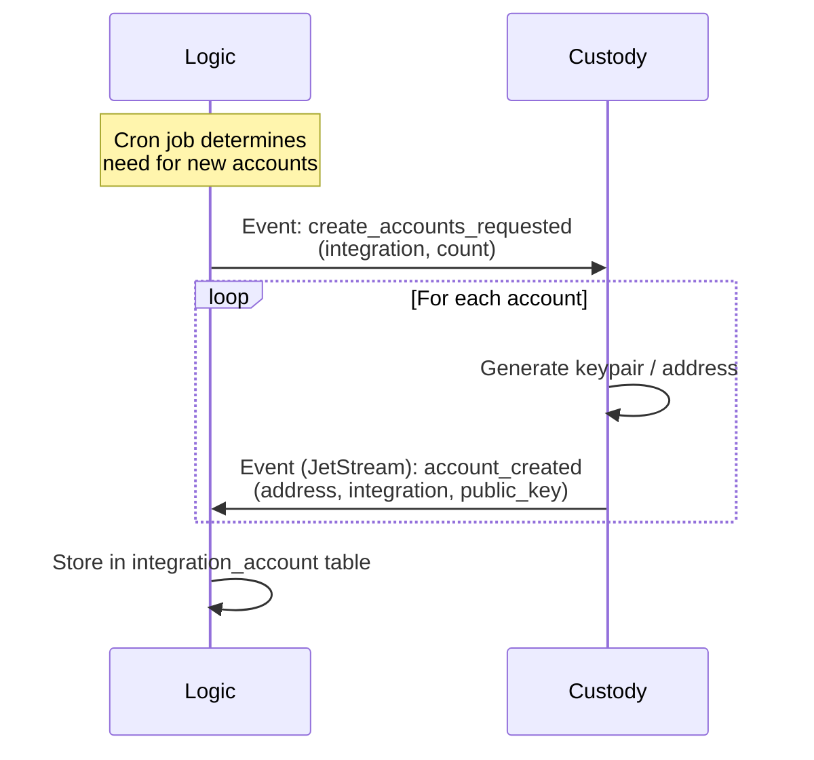
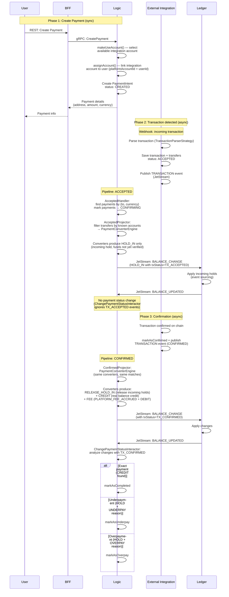
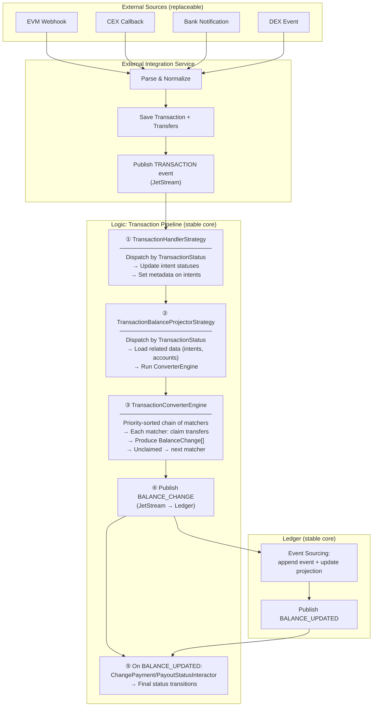
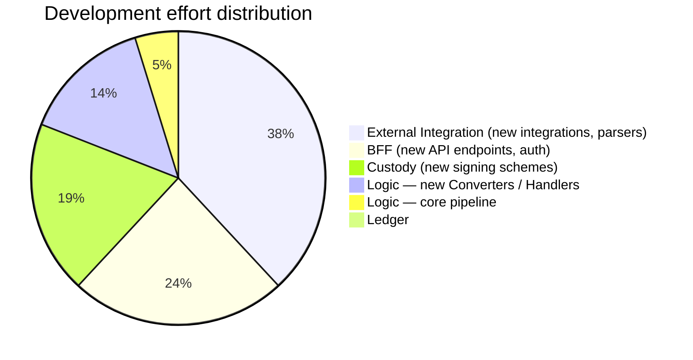

[](https://humanwrittensoftware.org)

# Multi-Rail Payments Processor
>Demo backend illustrating payment processing across multiple rails: blockchain, banks, CEX and DEX integrations.

# Payment Infrastructure - Event-Driven Architecture

> ⚠️ **Note**: This codebase is currently under development. However, it provides sufficient context to understand the architectural principles, logic separation, and responsibility boundaries of the system.

## Project Overview

This project demonstrates a clean, scalable payment infrastructure built with Event-Driven Architecture (EDA), Domain-Driven Design (DDD), and Clean Architecture principles. The goal is to showcase how complex financial operations can be implemented with:

- **Minimal database tables** - only what's necessary
- **Clear service boundaries** - each service has a single responsibility
- **Transparent data flows** - easy to understand and trace
- **Isolated services** - no tight coupling between components

## Quick Start

### Prerequisites
- Node.js
- Yarn
- Docker

### Installation & Run

1. Install dependencies:
```bash
   yarn install --frozen-lockfile
```

2. Start infrastructure services:
```bash
   docker compose -f docker-compose.dev.yml up -d
```
---------------
###### (Hint) Use command for faster start (for migrations and start all. Or run commands separately):
````bash
   yarn run:demo
````
------------------
3. Run database migrations:
```bash
   yarn migration:run
```

4. Seed the database with fixtures:
```bash
   yarn fixtures
```

5. Start all services:
```bash
   yarn start:all
```

## Architecture Principles

### Core Design Decisions

1. **Event-Driven Architecture (EDA)** - Services communicate primarily through events via NATS JetStream
2. **Domain-Driven Design (DDD)** - Clear bounded contexts and domain models
3. **Clean Architecture** - Dependency inversion, business logic isolated from infrastructure
4. **Event Sourcing for Ledger** - Complete audit trail and state reconstruction capability
5. **Minimal Complexity** - Simple, straightforward flows without over-engineering

### Technology Stack

- **Event Streaming**: NATS JetStream
- **Synchronous Communication**: gRPC
- **Event Sourcing**: PostgreSQL

## Services Description

### 1. BFF (Backend for Frontend)
**Responsibility**: Gateway to the external world

- Exposes REST API for frontend applications
- Handles authentication and request validation
- Communicates with Logic service via gRPC
- No business logic - pure gateway pattern

### 2. Logic
**Responsibility**: Core business logic orchestrator

- Central hub for all event processing
- Makes business decisions (integration account selection, status transitions)
- Orchestrates workflows across services
- Maintains payment/payout intent state machines
- Manages integration account links (binding integration accounts to platform accounts)
- Runs the unified **transaction processing pipeline** (handler → projector → converter → ledger)

**Key Entities**:
- `payment_intent` — incoming payment intents
- `payout_intent` — outgoing payout intents
- `integration_account` — external accounts (blockchain addresses, exchange accounts)
- `integration_account_link` — bindings between integration accounts and platform accounts/users
- `account` — platform accounts (users, merchants)
- `escrow` — escrow holds
- `integration_currency` — supported currencies per integration

### 3. Ledger
**Responsibility**: Event-sourced balance management

- Implements event sourcing for all balance changes
- Maintains 4 tables (2 event stores + 2 projections) + inbox for idempotency
- Provides complete audit trail
- Handles balance holds/releases
- No knowledge of business context — works with `BalanceChange` events only (account + amount + type + metadata)

**Tables Structure**:
1. `integration_account_es` — event store for integration account balances (by integration account address)
2. `platform_account_es` — event store for platform account balances (by platform accountId)
3. `integration_account_projection` — projection: current integration account balance
4. `platform_account_projection` — projection: current platform account balance

### 4. External Integration
**Responsibility**: Communication with external systems

- Integrations with CEX (Centralized Exchanges), DEX (Decentralized Exchanges), Banking, Blockchain
- Receives `TransferIntent` events from Logic and builds actual transactions
- Parses incoming blockchain transactions via webhooks
- Manages `TransferIntent` → `TransactionIntent` → `Transaction` lifecycle
- Determines transaction execution strategy (single/batch/bridge)
- Publishes `TRANSACTION` events back to Logic for pipeline processing

**Key Entities**:
- `transfer_intent` — requested transfer from Logic (what needs to happen)
- `transaction_intent` — built but not yet confirmed transaction (how to do it)
- `transaction` / `transfer` — actual on-chain transactions and their transfers

### 5. Custody
**Responsibility**: Key management and transaction signing

- Creates blockchain accounts/addresses on demand
- Securely stores private keys (HSM, MPC, or software vault)
- Signs transactions upon request from External Integration
- No business logic — pure cryptographic operations

## Data Flow Diagrams

### 1. Create Integration Account Flow


**Description**:
1. Logic proactively determines integration account shortage via cron job
2. Sends event to Custody requesting N accounts for specific integration(s)
3. Custody creates accounts sequentially (generates keypairs)
4. Each created account triggers event to Logic
5. Logic persists account information in `integration_account` table

---

### 2. Payment Flow (Incoming) — Pipeline

The payment flow works as a two-phase pipeline. On `ACCEPTED` (mempool/first seen) the system places incoming holds (`HOLD_IN`) — funds are "frozen" pending verification. Only on `CONFIRMED` (block confirmation) does the system release those holds, apply real credits, fees, and transition the payment to its final status.



**Description**:

**Phase 1: Create Payment (Synchronous)**
1. User requests payment creation via BFF → Logic
2. Logic selects an available integration account (`makeUseAccount`) and links it to the user (`assignAccount`)
3. Logic creates a `PaymentIntent` with status `CREATED` including platform fee configuration
4. Returns the deposit address, amount, and currency to the user

**Phase 2: Transaction Detected → ACCEPTED Pipeline (Asynchronous)**
5. External Integration receives a webhook with a blockchain transaction
6. It parses the transaction, saves it with transfers, and publishes a JetStream `TRANSACTION` event with status `ACCEPTED`
7. Logic receives the event and runs the **pipeline**:
    - **Handler** (`AcceptedHandler`): finds payments matching transfers by `(to, currency)` in status `CREATED`, marks them `CONFIRMING`
    - **Projector** (`AcceptedProjector`): filters transfers to only those involving known integration accounts, then runs `PaymentConverterEngine`
    - **Converters** (ExactPayment, Overpay, Underpay, etc.): match transfers to payment intents but **produce only `HOLD_IN` changes** — incoming holds with `txStatus=TX_ACCEPTED`. No credits, no fees at this stage.
8. Logic sends HOLD_IN changes to Ledger → Ledger applies → publishes `BALANCE_UPDATED`
9. `ChangePaymentStatusInteractor` receives the event but **does nothing** — it only reacts to `TX_CONFIRMED` events. Payment stays in `CONFIRMING`.

**Phase 3: Confirmation → CONFIRMED Pipeline (Asynchronous)**
10. When the transaction is confirmed on-chain, EIS publishes `TRANSACTION` event with status `CONFIRMED`
11. Logic runs the same pipeline with the same converters, but now the converters **detect `CONFIRMED` status and produce the full set of changes**:
    - `RELEASE_HOLD_IN` — release the incoming holds placed at ACCEPTED
    - `CREDIT` — real balance credit to user's platform account and integration account
    - `PLATFORM_FEE_ACCRUED` + `DEBIT` — platform fee processing (if configured)
12. Ledger applies all changes, publishes `BALANCE_UPDATED`
13. `ChangePaymentStatusInteractor` now finds matching `TX_CONFIRMED` events and sets the final status:
    - `CREDIT` found → `COMPLETED`
    - `HOLD` with reason `UNDERPAY` → `UNDERPAY`
    - `HOLD` with reason `OVERPAY` → `OVERPAY`

**Payment Status Progression**: `CREATED` → `CONFIRMING` → `COMPLETED` / `UNDERPAY` / `OVERPAY`

**Key: Same Converters, Two Behaviors**
Each payment converter (ExactPayment, Overpay, Underpay, etc.) handles both ACCEPTED and CONFIRMED in a single `execute()` method. The behavior switches based on `transaction.status`:

```
if (status === ACCEPTED)  → return [HOLD_IN]           // incoming hold, funds not yet verified
if (status === CONFIRMED) → return [RELEASE_HOLD_IN,   // release incoming holds
                                    CREDIT,             // real balance credit
                                    FEE changes]        // platform fee
```

Matching logic (which transfer belongs to which payment) is shared — the transaction phase only controls which balance operations are produced.

**PaymentConverterEngine (Priority Chain)**
The converter engine processes transfers through an ordered chain of matchers. Each matcher claims matching transfers and produces balance changes; unclaimed transfers pass to the next matcher:
- **ExactPayment**: transfer amount matches payment amount exactly
- **SequentialExactPayment**: sequential partial payments that sum to exact amount
- **OverpayPayment**: transfer amount exceeds payment amount
- **UnderpayPayment**: transfer amount is less than payment amount
- **MispayPayment**: currency or other mismatch

---

### 3. Payout Flow (Outgoing) — Pipeline

The payout flow is a full pipeline: Logic creates the intent and publishes a `TransferIntent`, then External Integration builds and executes the transaction. Each status change produces a `TRANSACTION` event that Logic processes through the same handler → projector/converter → ledger chain.

```mermaid
sequenceDiagram
    participant User
    participant BFF
    participant Logic
    participant ExtInt as External Integration
    participant Ledger
    participant Custody

    Note over User,Logic: Phase 1: Create Payout (sync)
    User->>BFF: REST: Create Payout
    BFF->>Logic: gRPC: CreatePayout

    Logic->>Ledger: gRPC: getBalances<br/>(user + hot account)
    Ledger-->>Logic: balances

    Logic->>ExtInt: gRPC: getEstimatedTransferFee
    ExtInt-->>Logic: { fee, currency }
    Logic->>Logic: Convert fee currency if needed<br/>(CurrencyConverterProvider)

    Logic->>Logic: getPlatformHotAccount() — select<br/>source integration account (from)
    Logic->>Logic: PayoutBalancePolicy.validate()<br/>check user + integration account balances

    Logic->>Logic: Create PayoutIntent<br/>status: CREATED

    Logic->>ExtInt: JetStream: TransferIntent CREATE<br/>(intentId, intentType=PAYOUT,<br/>from, to, amount, estimatedFee)
    Logic-->>BFF: Payout created
    BFF-->>User: Payout info

    Note over ExtInt: Phase 2: Build Transaction (async, cron) - (strategy: one transfer per transaction)
    ExtInt->>ExtInt: Cron: claimOne() TransferIntent
    ExtInt->>ExtInt: Build transaction<br/>(EvmSingleTransferBuilder)
    ExtInt->>ExtInt: Save TransactionIntent<br/>status: HOLD_PENDING
    ExtInt->>ExtInt: Save Transaction<br/>status: PREPARED
    ExtInt->>ExtInt: Publish TRANSACTION event<br/>(PREPARED + transfer intents)

    Note over Logic: Pipeline: PREPARED
    Logic->>Logic: PreparedHandler:<br/>find payouts by intentId,<br/>mark → PREPARED<br/>(set integrationFee, feePayer)
    Logic->>Logic: PreparedProjector:<br/>PayoutHoldConverter →<br/>HOLD balance changes<br/>(amount + platformFee +<br/>estimatedIntegrationFee)
    Logic->>Ledger: JetStream: BALANCE_CHANGE<br/>(HOLD user + HOLD integration account)
    Ledger->>Ledger: Apply holds (event sourcing)
    Ledger->>Logic: JetStream: BALANCE_UPDATED

    Logic->>Logic: ChangePayoutStatusInteractor:<br/>mark payout → HELD
    Logic->>ExtInt: JetStream: TransferIntent HELD<br/>(intentIds)

    Note over ExtInt: Phase 3: Sign & Promote (async)
    ExtInt->>ExtInt: markAsPrepared(transferIntents)
    ExtInt->>ExtInt: Find READY_FOR_SIGN intents (cron)
    ExtInt->>ExtInt: markReadyForSigning
    ExtInt->>Custody: Sign transaction
    Custody-->>ExtInt: Signed payload
    ExtInt->>ExtInt: makeReadyToPromote

    ExtInt->>ExtInt: Promote: markPromoted<br/>(transactionIntent + transaction)
    ExtInt->>ExtInt: Publish TRANSACTION event<br/>(PROMOTED + transfer intents)

    Note over Logic: Pipeline: PROMOTED
    Logic->>Logic: PromotedHandler:<br/>mark payouts → PROCESSING

    Note over ExtInt: Phase 4: Blockchain Confirmation (async)
    Note over ExtInt: Webhook: transaction accepted on-chain
    ExtInt->>ExtInt: Parse & save ACCEPTED tx
    ExtInt->>ExtInt: markCompleted(transactionIntent)
    ExtInt->>ExtInt: Publish TRANSACTION event<br/>(ACCEPTED + transfer intents)

    Note over Logic: Pipeline: ACCEPTED
    Logic->>Logic: AcceptedHandler:<br/>mark payouts → CONFIRMING<br/>(set actual integrationFee,<br/>feePayerAccount)

    Note over ExtInt: Transaction confirmed
    ExtInt->>ExtInt: markAsConfirmed
    ExtInt->>ExtInt: Publish TRANSACTION event<br/>(CONFIRMED + transfer intents)

    Note over Logic: Pipeline: CONFIRMED
    Logic->>Logic: ConfirmedProjector:<br/>PayoutConverter →<br/>RELEASE_HOLD + DEBIT +<br/>PLATFORM_FEE_ACCRUED<br/>balance changes
    Logic->>Ledger: JetStream: BALANCE_CHANGE
    Ledger->>Ledger: Apply changes
    Ledger->>Logic: JetStream: BALANCE_UPDATED
    Logic->>Logic: ChangePayoutStatusInteractor:<br/>mark payout → SUCCESS
```



**Description**:

**Phase 1: Create Payout (Synchronous — Steps 1-7)**

1. **Check balances**: Logic calls Ledger via gRPC to verify user has sufficient funds and the hot integration account has enough to cover the transfer
2. **Estimate fee**: Logic calls EIS for estimated transfer fee, then converts to the payout currency if needed (`CurrencyConverterProvider`)
3. **Select source account**: Logic finds the platform hot account (`getPlatformHotAccount`) for the given integration and currency
4. **Validate**: `PayoutBalancePolicy` checks both user balance and integration account balance are sufficient
5. **Create PayoutIntent**: Logic creates the intent with status `CREATED` including fee estimates, platform fee, exchange rate, destination account
6. **Publish TransferIntent**: Logic publishes a `TransferIntent CREATE` event to EIS via JetStream with all transfer details (from, to, amounts, fee)
7. **Response**: User receives confirmation that payout is created and queued

**Phase 2: Build Transaction (Asynchronous — Cron in EIS)**

8. EIS cron (`CreateTransactionIntentInteractor`) claims a pending `TransferIntent`
9. Builds an unsigned transaction (`EvmSingleTransferBuilder`)
10. Saves `TransactionIntent` (status: `HOLD_PENDING`) and `Transaction` (status: `PREPARED`)
11. Publishes `TRANSACTION` event with status `PREPARED` and transfer intent metadata

**Pipeline: PREPARED**

12. **Handler** (`PreparedHandler`): finds payouts in `CREATED` status by intentId, marks them `PREPARED`, sets `integrationFee` and `feePayer` from the actual transaction data
13. **Projector** (`PreparedProjector`): runs `PayoutHoldConverter` which produces `HOLD` balance changes — holds on user's platform account (amount + platform fee) and on hot integration account (amount + estimated integration fee)
14. Logic sends all holds to Ledger → Ledger applies → publishes `BALANCE_UPDATED`
15. `ChangePayoutStatusInteractor`: detects HOLD events with `txStatus=TX_PREPARED`, marks payout `HELD`
16. Logic publishes `TransferIntent HELD` event back to EIS

**Phase 3: Sign & Promote (Asynchronous — Finalize flow in EIS)**

17. EIS receives HELD event → marks transfer intents as `PREPARED`
18. Cron finds `READY_FOR_SIGN` transaction intents → signs via Custody
19. After signing: marks `READY_TO_PROMOTE`, then promotes (sends to blockchain)
20. Publishes `TRANSACTION` event with status `PROMOTED`

**Pipeline: PROMOTED**

21. **Handler** (`PromotedHandler`): marks payouts `PROCESSING`
22. No balance changes at this stage

**Phase 4: Blockchain Confirmation (Asynchronous)**

23. Blockchain sends webhook → EIS parses as `ACCEPTED`, publishes event

**Pipeline: ACCEPTED**

24. **Handler** (`AcceptedHandler`): marks payouts `CONFIRMING`, sets actual `integrationFee`, `integrationFeePayerAccount`

25. Once confirmed on-chain → EIS publishes `CONFIRMED` event

**Pipeline: CONFIRMED**

26. **Projector** (`ConfirmedProjector`): runs `PayoutConverter` which produces: `RELEASE_HOLD` (release previous holds) + `DEBIT` (actual amounts) + `PLATFORM_FEE_ACCRUED`
27. Logic sends to Ledger → Ledger applies → publishes `BALANCE_UPDATED`
28. `ChangePayoutStatusInteractor`: detects DEBIT with `txStatus=TX_CONFIRMED`, marks payout `SUCCESS`

**Payout Status Progression**: `CREATED` → `PREPARED` → `HELD` → `PROCESSING` → `CONFIRMING` → `SUCCESS`

**TransferIntent Status Progression**: `CREATED` → `ACCEPTED` → `PREPARED` → `PROCESSING` → `COMPLETED`

**TransactionIntent Status Progression**: `HOLD_PENDING` → `READY_FOR_SIGNING` → `SIGNING` → `READY_TO_PROMOTE` → `PROMOTED` → `COMPLETED`

**Transaction Status Progression**: `PREPARED` → `PROMOTED` → `ACCEPTED` → `CONFIRMED`

**Key: The Pipeline Pattern**

Both payment and payout share the same processing pipeline in Logic:

```
TRANSACTION event (JetStream)
  → TransactionHandlerStrategy (status-based dispatch)
    → Handler: update intent statuses, set metadata
  → TransactionBalanceProjectorStrategy (status-based dispatch)
    → Projector: load data, run TransactionConverterEngine
      → ConverterEngine: priority-sorted chain of matchers
        → Each converter: match transfers → produce BalanceChange[]
  → LedgerRepository.changeBalance() (JetStream → Ledger)
    → Ledger processes (event sourcing) → BALANCE_UPDATED event
  → ChangePayment/PayoutStatusInteractor: final status transitions
```

This pipeline is the same regardless of whether the transaction is a payment or payout. The handlers and projectors are selected by `TransactionStatus`, and the converters inside the engine are selected by priority matching against the transfers and intents.

---

## Pipeline Architecture — The Conveyor

The central idea of this system is a **unified transaction processing pipeline** inside Logic. Every external event (blockchain webhook, exchange notification, bank callback) eventually becomes a `TRANSACTION` event with a `TransactionStatus`. Logic processes it through the same conveyor regardless of the source or intent type.

### How the Pipeline Works



### Where the Complexity Lives

The pipeline architecture creates a clear separation: the **core is stable**, and the **edges are where new work happens**.



The pipeline in Logic is a stable core. It doesn't change when adding new integrations. All new work happens either at the edges of the system (EIS, BFF, Custody) or by adding new converters and handlers into the existing pipeline — without modifying existing code.

A new integration (Solana, SWIFT, CEX) means a new parser, transaction builder, and controller in External Integration. The pipeline stays untouched. A new business scenario (batch payout etc.) means a new `Strategy` in External integration service.
To add internal translations, it is also mainly only affected EIS.
---

### Event-Driven Communication (Primary)

**Via NATS JetStream**:
- Asynchronous service-to-service communication
- Event persistence and replay capability
- At-least-once delivery guarantees
- Decoupled services

**Event Types**:
- Domain events (business facts that happened)
- Integration events (cross-service notifications)
- Command events (requests for actions)

### Synchronous Communication (Secondary)

**Via gRPC**:
- BFF → Logic (user-facing operations requiring immediate response)
- Logic → Ledger (balance queries: `getBalances`)
- Logic → External Integration (fee estimation: `getEstimatedTransferFee`)
- Used sparingly to maintain loose coupling

---

## Why JetStream over Kafka?

### Advantages of NATS JetStream

#### ✅ Simplicity
- Significantly easier to deploy and operate
- Single binary, minimal configuration
- Lower operational overhead

#### ✅ Performance
- Lower latency for small-to-medium message volumes
- More efficient resource utilization
- Better performance for request-reply patterns

#### ✅ Built-in Features
- Native support for exactly-once semantics
- Built-in message deduplication
- Key-value store and object storage
- Distributed cache capabilities

#### ✅ Ecosystem Integration
- Part of NATS ecosystem (messaging, KV, object store)
- Unified client libraries
- Consistent operational model

#### ✅ Developer Experience
- Simpler API and mental model
- Better documentation and examples
- Faster learning curve

### Trade-offs

#### ⚠️ Kafka Advantages
- Better for extremely high throughput (millions of messages/sec)
- More mature ecosystem of connectors
- Larger community and more production deployments
- Better tooling for very large deployments

#### 💡 Our Choice
For this payment infrastructure:
- **Message volume**: Moderate (thousands, not millions per second)
- **Latency requirements**: Low (sub-second processing)
- **Operational complexity**: Minimize (small team)
- **Development speed**: High priority

**JetStream is the better fit** - provides all needed capabilities with significantly lower complexity.

---

## Ledger as Event Sourcing

### Why Event Sourcing for Financial Data?

#### Complete Audit Trail
Every balance change is recorded as an immutable event with full context:
- Who initiated the change
- When it occurred
- What triggered it (intentType, intentId, txId, reason)
- Original state and new state

#### State Reconstruction
- Rebuild any integration account or platform account balance at any point in time
- Investigate historical states for compliance and auditing
- Recover from data corruption

#### Business Intelligence
- Analyze transaction patterns
- Generate financial reports
- Track money flow across the system

### Ledger Architecture
```
Event Stores (Append-Only):
├── integration_account_es
│   └── Records: integration account balance changes, holds, releases
│   └── Key: (account, integration, currency)
└── platform_account_es
    └── Records: platform account (user) balance changes
    └── Key: (accountId, integration, currency)

Projections (Current State):
├── integration_account_projection
│   └── Current integration account balances (real-time view)
└── platform_account_projection
    └── Current platform account balances (real-time view)

Idempotency:
└── balance_event_inbox
    └── Deduplication of incoming balance change events
```

### Event Metadata

Each `BalanceChange` event includes rich metadata:
- **Transaction identifiers**: `txId`, `transferIds`
- **Intent binding**: `intentType` (PAYMENT / PAYOUT), `intentId`
- **Balance change semantics**: `reason` (AMOUNT, FEE, OVERPAY, UNDERPAY, etc.), `txStatus` (TX_PREPARED, TX_ACCEPTED, TX_CONFIRMED)
- **Business context**: `type` (CREDIT, DEBIT, HOLD, HOLD_IN, RELEASE_HOLD, RELEASE_HOLD_IN, PLATFORM_FEE_ACCRUED)

### Benefits Over Simple Transaction Logs

| Feature | Event Sourcing | Simple Logs |
|---------|---------------|-------------|
| **State Reconstruction** | ✅ Full state rebuild | ❌ Only current state |
| **Point-in-Time Queries** | ✅ Any historical state | ❌ Requires manual calculation |
| **Audit Trail** | ✅ Complete with context | ⚠️ Basic timestamps only |
| **Debugging** | ✅ Replay events to reproduce | ❌ Hard to reproduce issues |
| **Compliance** | ✅ Immutable, timestamped | ⚠️ Logs can be lost/rotated |
| **Business Analytics** | ✅ Rich event stream | ❌ Limited data |

---

## Observability Considerations

### Distributed Tracing

**Challenge**: Following a single user request across multiple services and async events.

**Solution**:
- **Trace ID propagation** through all events and gRPC calls
- **Correlation IDs** link related events (`intentType` + `intentId`, `txId`, `transferIds`)
- **Event metadata** carries tracing context

**Recommended Stack**:
- OpenTelemetry for instrumentation
- Jaeger or Tempo for trace storage
- Grafana for visualization

### Event Monitoring

**Key Metrics**:
- Event processing latency per service
- Event queue depths
- Failed event deliveries
- Retry counts

**Alerting**:
- Dead letter queue depth > threshold
- Event processing lag > X seconds
- Balance mismatch detection


### Business Metrics (coming soon)

**Financial Operations**:
- Payment success rate
- Payout completion time (p50, p95, p99)
- Failed transaction rate
- Balance hold duration

**System Health**:
- Integration account pool availability
- Ledger event processing lag
- External Integration uptime

**Log Levels**:
- **INFO**: Business events (payment created, payout completed)
- **WARN**: Retries, degraded operations
- **ERROR**: Failed operations requiring intervention

---

## Summary

This payment infrastructure demonstrates:

✅ **Simplicity** - Clear service boundaries, minimal database tables  
✅ **Transparency** - Easy to understand data flows  
✅ **Scalability** - Event-driven architecture enables horizontal scaling  
✅ **Auditability** - Complete financial audit trail via event sourcing  
✅ **Maintainability** - Clean architecture, DDD principles  
✅ **Reliability** - Event persistence, retry mechanisms, distributed tracing

**Perfect for**: Teams seeking a clean, scalable payment infrastructure without over-engineering.

---